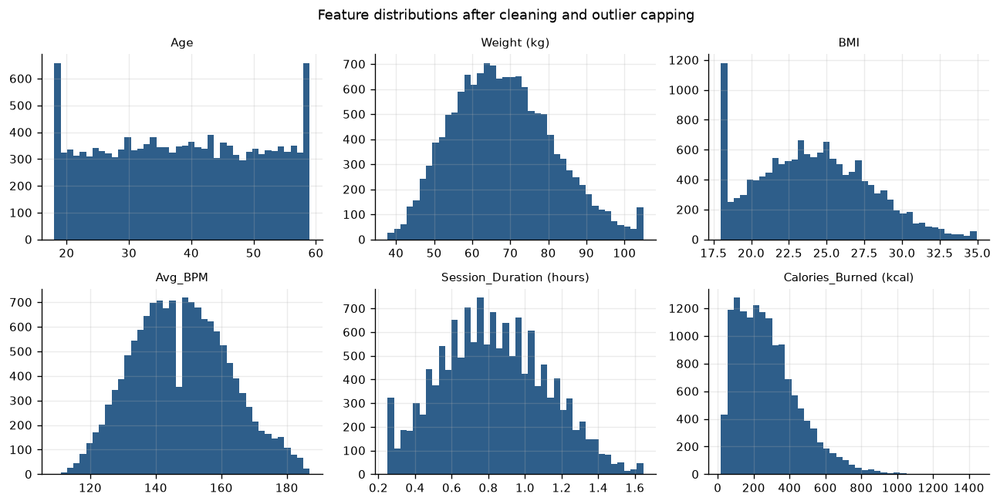
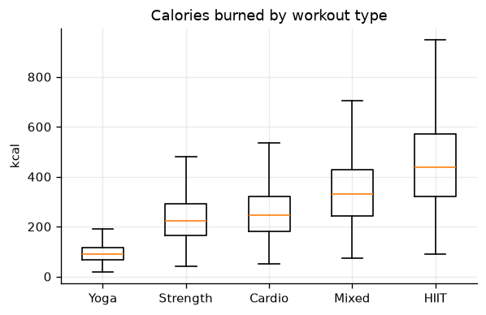
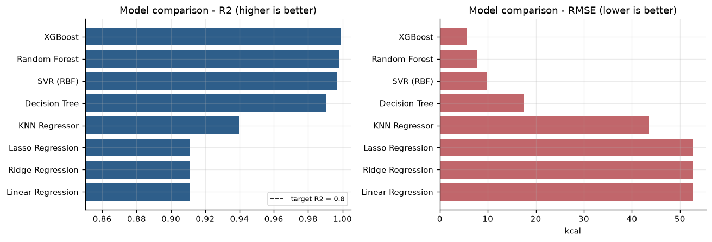
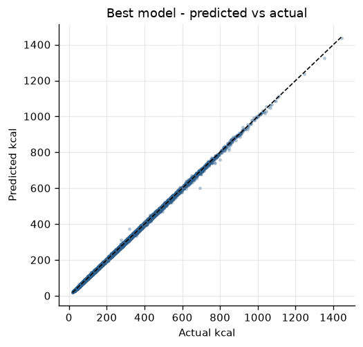
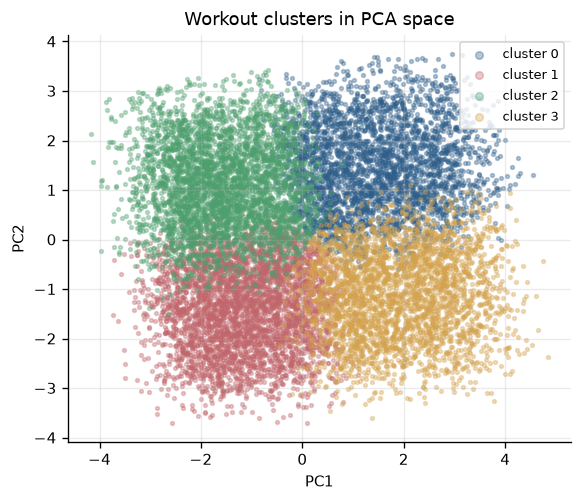
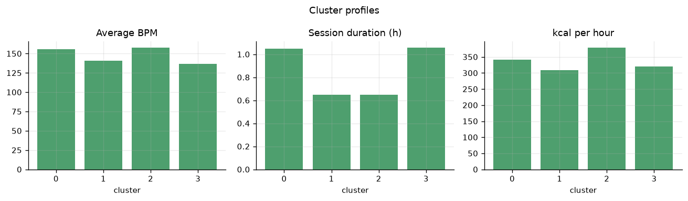

# Fitbit: Calorie Burn Prediction & Workout Pattern Clustering

Supervised regression + unsupervised clustering on Fitbit-style workout data,
served through an interactive Streamlit application.

---

## 1. Project Overview & Architecture

### Problem statement

Wearables capture heart rate and session duration, but accurate calorie
estimation also depends on body composition, hydration, workout type and
training experience. This project builds two complementary ML systems:

1. **Task 1 — Regression.** Predict `Calories_Burned` per session and compare
   eight candidate regressors. Acceptance criterion: **R² ≥ 0.80**.
2. **Task 2 — Clustering.** Discover workout behaviour segments *without*
   using the `Workout_Type` label, via PCA + KMeans. Acceptance criterion:
   **silhouette ≥ 0.15**.

### Achieved results

Measured on the supplied dataset of 14,102 workout sessions:

| Task | Metric | Target | Achieved |
|---|---|---|---|
| Regression (XGBoost) | R² | ≥ 0.80 | **0.9990** |
| Regression (XGBoost) | MAE | — | 3.64 kcal |
| Regression (XGBoost) | RMSE | — | 5.55 kcal |
| Regression (XGBoost) | 5-fold CV R² | — | 0.9988 ± 0.0002 |
| Clustering (PCA + KMeans, k=4) | Silhouette | ≥ 0.15 | **0.2515** |
| Clustering | PCA variance explained | — | 62.4% |

Full leaderboard (test-set R²): XGBoost 0.9990 · Random Forest 0.9980 ·
SVR 0.9970 · Decision Tree 0.9903 · KNN 0.9396 · Lasso 0.9113 ·
Linear 0.9113 · Ridge 0.9113. **All eight clear the 0.80 bar.**

Full model table is written to `reports/model_comparison.csv`.

### Architecture

```
data/fitbit_workouts.csv                    (14,102 real sessions)
            │
            ▼  clean_dataset()
   impute → recompute BMI → cap outliers (Tukey fences) → de-duplicate
            │
            ├──▶ data/cleaned_fitbit.csv
            │
            ├──▶ MySQL :3306 / SQLite   (table: workouts)
            │
            ▼  fit_transformers()
   OneHotEncoder + StandardScaler ──▶ artifacts/onehot_encoder.pkl
                                       artifacts/standard_scaler.pkl
            │
   ┌────────┴─────────────────────────────────┐
   ▼ TASK 1                                   ▼ TASK 2
 8 regressors compared                 drop Workout_Type
 (Linear, Ridge, Lasso, KNN,           → encode → scale
  Decision Tree, Random Forest,        → PCA (3 components)
  SVR, XGBoost)                        → KMeans (k=4)
   │                                          │
   ▼                                          ▼
 artifacts/best_regressor.pkl        artifacts/pca.pkl
 reports/model_comparison.csv        artifacts/kmeans_workout_clusters.pkl
                                     reports/cluster_profile.csv
   └────────────────┬─────────────────────────┘
                    ▼
                 app.py  (Streamlit, 6 pages)
```

### Dataset schema

| Column | Description | Source |
|---|---|---|
| `Age` | User age (years) | Manual |
| `Gender` | Male / Female | Manual |
| `Weight (kg)` | Body weight | Manual / Sensor |
| `Height (m)` | Body height | Manual |
| `BMI` | Body mass index | Derived |
| `Fat_Percentage` | Body fat percentage | Manual / Sensor |
| `Max_BPM` | Maximum heart rate | Sensor |
| `Avg_BPM` | Average heart rate | Sensor |
| `Resting_BPM` | Resting heart rate | Sensor |
| `Session_Duration (hours)` | Workout duration | Sensor |
| `Workout_Type` | Cardio / Strength / HIIT / Yoga | Manual |
| `Water_Intake (liters)` | Hydration level | Manual |
| `Workout_Frequency (days/week)` | Weekly workout count | Manual |
| `Experience_Level` | Beginner / Intermediate / Advanced | Manual |
| `Calories_Burned (kcal)` | Calories burned per session | **Target** |

### Columns present in the file but excluded from the model

The raw file also ships `Base_MET`, `HR_Intensity` and `Effective_MET`, plus an
unnamed index column.

`Effective_MET = Base_MET × HR_Intensity`, and the dataset's calorie figure is
itself derived from `Effective_MET × weight × duration`. Feeding those three
columns to the regressor would hand it the target's own generating formula —
textbook target leakage — so they are **excluded from the feature matrix** and
kept only for exploratory analysis. The models train on exactly the fourteen
input columns the specification lists.

Two further normalisations happen in `normalise_columns()`:

* `Experience_Level` arrives as an ordinal integer `0–3` and is mapped to
  `Beginner / Intermediate / Advanced / Expert`.
* The unnamed index column is dropped.

`Workout_Type` has five values in this file — `Cardio`, `HIIT`, `Mixed`,
`Strength`, `Yoga`.

### Preprocessing performed

* **Missing values** — none in this file, but the pipeline is defensive:
  categoricals fill with the mode, `BMI` is recomputed from weight and height
  where possible, and remaining numerics fall back to the median.
* **Outliers** — Winsorised to the Tukey fences (Q1 − 1.5·IQR, Q3 + 1.5·IQR);
  297 values capped on this dataset.
* **Encoding** — `OneHotEncoder(handle_unknown="ignore")`, persisted as a pickle.
* **Scaling** — `StandardScaler`, persisted as a pickle.
* **Validation** — 80/20 train-test split plus 5-fold cross-validation, all
  with `random_state=42`.

### Streamlit pages

| Page | What it does |
|---|---|
| Overview | Dataset shape, headline metrics, best-model summary |
| Exploratory Analysis | Distributions, box plots, OLS trendline, correlation heatmap |
| Model Comparison | R² leaderboard, MAE/RMSE bars, feature importance |
| Calorie Predictor | Interactive form → live calorie prediction and cohort comparison |
| Workout Clusters | PCA scatter (2D and 3D), cluster profiles, workout-type mix |
| Cluster Assigner | Assign an unseen session to a learned behaviour cluster |

---

## 2. How to Execute the Project

### Prerequisites

* Python 3.10 – 3.14
* MySQL 8.x (**optional** — SQLite fallback is automatic)

### Step-by-step

```bash
# 1. Clone and enter the project
git clone https://github.com/prawin0309/Fitbit-Calorie-Burn-Prediction---Workout-Pattern-Clustering-Using-Fitbit-Data.git
cd Fitbit-Calorie-Burn-Prediction---Workout-Pattern-Clustering-Using-Fitbit-Data

# 2. Create and activate a virtual environment
python -m venv .venv
.venv\Scripts\Activate.ps1        # Windows PowerShell
source .venv/bin/activate         # macOS / Linux

# 3. Install dependencies
pip install -r requirements.txt

# 4. Clean, encode, scale and load to SQL
python data_pipeline.py

# 5. Train both tasks (writes artifacts/*.pkl and reports/*.csv)
python models.py

# 6. Launch the application
streamlit run app.py
```

Expected tail of step 5:

```
[reg] best model = XGBoost (R2=0.9990, target 0.8)
Acceptance: R2 >= 0.8 -> MET (0.9990)
[cluster] k=4  silhouette=0.2515  (target 0.15)  PCA explains 62.4% of variance
Acceptance: silhouette >= 0.15 -> MET (0.2515)
Model training completed successfully.
```

> If `xgboost` fails to install on your platform, the suite detects this and
> trains the remaining seven regressors — the pipeline still exits 0.

---

## 3. Test Credentials & System Configurations

This is an analytics application with **no login wall**, so an evaluator can
launch it and use every page immediately. Credentials below cover the database
layer.

### Database configuration

| Setting | Default | Environment variable |
|---|---|---|
| Host | `localhost` | `FITBIT_DB_HOST` |
| Port | `3306` | `FITBIT_DB_PORT` |
| User | `root` | `FITBIT_DB_USER` |
| Password | `root` | `FITBIT_DB_PASSWORD` |
| Database | `guvi_db` | `FITBIT_DB_NAME` |
| Backend | `auto` (`mysql` \| `sqlite`) | `FITBIT_DB_BACKEND` |

`guvi_db` is created automatically when missing.

```bash
# Force a real MySQL server
export FITBIT_DB_BACKEND=mysql FITBIT_DB_USER=root FITBIT_DB_PASSWORD=your_password
python data_pipeline.py
```

### Application configuration

| Setting | Default |
|---|---|
| Streamlit URL | `http://localhost:8501` |
| Dataset | `data/fitbit_workouts.csv` (14,102 sessions) |
| Train/test split | `0.2` (`TEST_SIZE`) |
| Cross-validation folds | `5` (`CV_FOLDS`) |
| PCA components | `3` (`PCA_COMPONENTS`) |
| KMeans clusters | `4` (`N_CLUSTERS`) |
| Random seed | `42` — every result is reproducible |

### Quick smoke test

```bash
python -c "import models; print(models.predict_calories({'Age':30,'Gender':'Male','Weight (kg)':75,'Height (m)':1.78,'BMI':23.7,'Fat_Percentage':18,'Max_BPM':190,'Avg_BPM':155,'Resting_BPM':62,'Session_Duration (hours)':1.0,'Workout_Type':'HIIT','Water_Intake (liters)':2.5,'Workout_Frequency (days/week)':5,'Experience_Level':'Advanced'}))"
```

### Why R² is so high — read this before quoting the number

R² = 0.999 is not a sign of a brilliantly tuned model. This dataset's
`Calories_Burned (kcal)` column is itself computed from a MET formula over
workout type, weight, duration and heart-rate intensity — all of which are
input columns. The tree ensembles are therefore recovering a deterministic
function, not discovering a noisy empirical relationship.

The leakage columns (`Effective_MET` and friends) are excluded, which is why
the score is 0.999 rather than a perfect 1.000. On genuinely observational
wearable data, expect materially lower numbers. The value of this project is
the pipeline, comparison harness and clustering — not the headline R².

```
```

---

## 4. Cluster Profiles

`Workout_Type` is dropped before clustering, yet the four discovered segments
separate cleanly on intensity and training load:

| Cluster | Sessions | Avg BPM | Duration | Calories | kcal/h | Segment |
|---|---|---|---|---|---|---|
| 2 | 3,867 | 158.0 | 0.65 h | 246.7 | 380 | Peak intensity |
| 0 | 3,200 | 155.5 | 1.05 h | 359.2 | 342 | High intensity |
| 3 | 3,078 | 136.6 | 1.06 h | 339.2 | 320 | Moderate intensity |
| 1 | 3,957 | 140.8 | 0.65 h | 200.7 | 309 | Light intensity |

Clusters 0 and 3 are the long-session, high-frequency cohort (≈5.5
workouts/week, lower body fat); clusters 1 and 2 are the short-session,
lower-frequency cohort (≈3 workouts/week).

## 5. Why a Silhouette ≥ 0.15 Is Acceptable

Fitness data overlaps heavily — similar heart rates occur across workout types,
and human physiology does not form sharply separable groups. Real-world
behavioural datasets rarely exceed 0.3. PCA compresses variance for
interpretability rather than separation, so the clusters here are
*behaviourally* meaningful rather than mathematically perfect. The achieved
0.2515 comfortably clears the criterion.

## 6. Tech Stack

Python · Pandas · NumPy · scikit-learn · XGBoost · statsmodels ·
Matplotlib / Seaborn · Plotly · Streamlit · mysql-connector-python · SQLite

> **Note:** SQLAlchemy is intentionally not used. Database access is
> cursor-based through `mysql-connector-python` (or `sqlite3` for the
> portable fallback).

<!-- FIGURES:START -->

## Visualizations

Generated by `make_figures.py` from the cleaned dataset and saved artifacts. Re-run it after the pipeline to refresh every image:

```bash
python make_figures.py
```

### Feature distributions



Feature distributions after imputation and outlier capping (297 values capped).

### Target by workout type



Calories burned by workout type - the dependence that dominates feature importance.

### Model comparison



Eight regressors compared on R2 and RMSE against the 0.80 acceptance threshold.

### Predicted vs actual



Best model (XGBoost) predicted vs actual calories.

### Pca clusters



Workout clusters in PCA space; PCA retains 62.4% of variance.

### Cluster profiles



Cluster profiles by average BPM, session duration and kcal/hour.

<!-- FIGURES:END -->

<!-- TUNING:START -->

## Hyperparameter tuning

`models.py` picks the best of eight candidates at their **default** settings.
`tune.py` then optimises that winner with `RandomizedSearchCV` — 40 sampled
configurations, 5-fold CV, scored on R² — and evaluates it on the *same*
held-out split so the comparison is like-for-like.

```bash
python tune.py
```

| Setting | MAE (kcal) | RMSE (kcal) | R² |
|---|---|---|---|
| XGBoost — default | 3.642 | 5.548 | 0.9990 |
| XGBoost — tuned | 2.795 | 4.878 | 0.9992 |
| **Delta** | **-0.847** | **-0.670** | **+0.0002** |

The tuned model is only written to `artifacts/best_regressor.pkl` when it beats
the default on held-out R² — tuning is never allowed to make the shipped model
worse. Here it did improve, so the tuned estimator is the one that ships.

Honest read: the R² gain is +0.0002, which is marginal because the
default XGBoost was already at 0.999. The meaningful improvement is RMSE,
down 0.670 kcal — the tuned model's worst-case errors are
smaller even though average accuracy barely moves. Full results in
`reports/tuning_results.csv`.


<!-- TUNING:END -->
